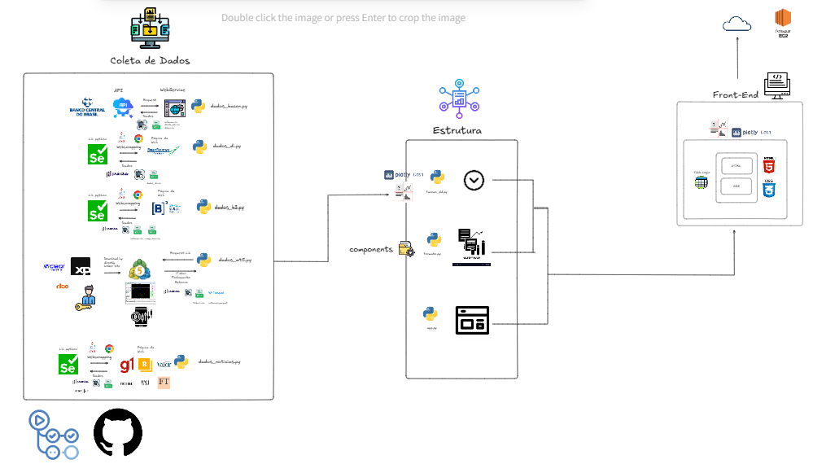

# Dashbaord de indicadores financeiros, econômicos e notícias 

Bem-vindos ao repositório do site open-source para visualização de dados econômicos e financeiros em tempo real!

## Sobre o projeto

Este projeto se trata de um site em dashboard para acompanhamento de ativos de mercado financeiro em tempo real. 

Uma página com tabelas e gráficos coletados dce diversas fontes e dispostos em visualizações interativas, com callbacks para escolha de qual indicador ou ativo você quer deseja ver e em qual linha temporal você deseja, bem como um painel de notícias dos principais veículos de informação do Brasil e do Mundo.

O layout do dashboard foi feito com a biblioteca [`dash`](https://dash.plotly.com/), do [`python`](https://www.python.org/), que facilita a integração de HTML e CSS para o design da página. 

Este dashboard está dividido em:


A) Índices de mercado em tempo real (mini-índice, mini-dolar, índice de small caps e ibovespa)
B) Gráficos de ativos em tempo real (ações das empresas da B3)
C) Indicadores econômicos (inflação, dívida/PIB, dólar, curva de juros)
D) Estatísticas (inflação, dívida/PIB, dólar, curva de juros)
E) Notícias de Economia e Tecnologia (Brasil e Mundo)

## Objetivos do Projeto

O principal objetivo foi coletar os dados de diversas fontes, tratar e carregar esses dados para geração das tabelas e gráficos. Para tanto, realizou-se uma organização inteligente por meio de pastas, para que cada função ou arquivo pudesse carregar os dados tratados de um só lugar.

Aprender a manipular e tratar dados de finanças e economia foi outra motivação para este projeto, dado a cursiosidade e expertise que tenho neste assunto. Além disso, serve como ferramente de tomada de decisão para investidores brasileiros usar como insumo para acompanhamento do mercado e auxiliar em seus investimentos.

## Principais Etapas do Projeto


### 1. Coleta e tratamento de dados 

Uso da biblioteca `python-bcb` para acessar os dados de inflação, divida/PIB e dólar, já tratados e dispostos em formato mensal, trimestral e diário, respectivametne.

Uso da biblioteca `selenium` para raspar dados dos contratos futuros de juros para compor a curva de juros DI. Este indicador é importante pois sinaliza qual a expectativa do mercado para os juros no futuro. Utilizou-se o selenium também para baixar a composição do Índice Bovespa, direto do site da B3, e assim se obter os setores de todas as empresas da bolsa.

Também se utilizou a mesma biblioteca para raspar dados de contratos futuros de juros e assim se calcular a curva de juros DI direto do site da BMV&Bovespa. Realizou-se em quatro recortes temporais: o juros DI de 1, 3, 5 e 10 anos atrás.

Para as notícias, foi uma junção de `selenium` e `bs4` para coletar dados de notícias de três jornais diferentes do Brasil: G1, Brazil Journal e Valor Econômico. Foram coletadas notícias de economia e tecnologia. E o mesmo para jornais interenacionais, como Wall Street Journal, Financial Times e Fortune 500. Com um acréscimo de notícias especificamente de Deep Dive, para os jornais internacionais.

E por fim, mas não menos importantes, utilizamos o terminal do MetaTrder5 para coletar dados de cotações para as ações da B3, mini-índice, mini-dólar e Índice Bovespa (IBOV) e Índice Small Cap (SMLL) por meio da lib proprietária do `MetaTrader5`.

### 2. Gráficos de ações ao vivo

Nesta etapa foi utilizada a biblioteca `plotly` para criação e plotagem dos gráficos de cotações.

Com base nos dados de fechamento, variação e ticker coletados direto do terminal do MetaTrader5, plotei gráficos de candlestick para as ações.

### 3. Tabela dos principais ativos, maiores altas e maiores baixas do Ibovespa

Inicialmente, carrego os tickers da bolsa do arquivo `setores.csv` dentro da pasta `data` e puxo as cotações em tempo real da função `puxar_cotacao` do script `dados_mtr_cotacoes.py`, filtro as ações de maior liquidez (>=1000000 vol_movimento_diario).

As maiores altas são as cinco ações que tiveram maior retorno no último dia, enquanto que as maiores baixas são as cinco ações que tiveram menor retorno no último dia.

### 4. Setores da Bolsa

Há também duas tabelas de visualização do ticker, preço e retorno das ações da B3, mas filtradas por setor. Fiz um callback que filtra a visualização dos dados por setores, como por exemplo: construção civil, transporte, petróleo, gás e biocombustíveis, mineração, dentre outros. 


### 5. Gráficos de Economia

Novamente por meio da biblioteca `plotly`, criamos inicialmente o layout da figura, adicionamos os traços desejados, bem como os atributos estéticos, uma função para atualizar o layout e, por fim, usar os dados carregados dentro da pasta `data` para plotar os index e valores na figura.

Os indicadores são: juros DI, inflação, dólar e dívida/PIB. Há callbacks que mostram os graficos em histórico de um, tres, cinco e dez anos. Para a inflação, especificamente, os índices que medimos e mostramos são dois: IPCA e IGP-M.

Em juros DI é possível ver duas curvas: um para os contratos de juros com as expectativas atuais (dados_novos), e outra curva com os contratos das expectatvias do momento em questão, como em um ano, três, cinco e de 10 anos atrás, do seu momento em questão até 2032.

### 6. Info de Estatísticas de Indicadores Econômicos.

Primeiramente, crio funções para realizar os cálculos de média e variação. As variações são dos últimos doze meses, e acumulada no ano. 

### 7. Notícias

As notícias estão no segundo painel: um painel chamado Notícias.

Nesse painel, possuem dois layouts principais: o layout Brasil e o layout Mundo. Em cada um deles, possuem dois sublyaouts, que são destinados às notícias de economia, e outro para as notícias de tecnologia. No Brasil, o callback mostra notícias do G1, do Brazil Journal e do Valor Econômico. Enquanto na aba Mundo, os callbacks são Fortune 500, Financial Times e Wall Street Journal, com um adicional do botão Deep-Dive, que mostra as últimas notícias e novidades sobre IA.

### 8. Deploy

Configuração de IAM, IP Estatísticos para a instância EC2 na AWS, para manter o dashboard ligado na nuvem. Usou-se um arquivo yaml para manter a rotina de atualização dos dados a cada um hora via GitHub Actions.

## Tecnologias Utilizadas

* Backend

1. [Pandas](https://pandas.pydata.org/docs/getting_started/index.html#getting-started) para manipulação e análise de dados
2. [Selenium](https://selenium-python.readthedocs.io/getting-started.html) e [BeautifulSoup](https://www.crummy.com/software/BeautifulSoup/bs4/doc/#quick-starthttps://www.crummy.com/software/BeautifulSoup/bs4/doc/#quick-start) para webscrapping de dados em páginas da internet
3. [MetaTrader5](https://www.mql5.com/en/book/advanced/python/python_install) para coleta de tickers de ações, índices e mini-contratos, bem como preços e retornos de ativos em tempo real
4. [Plotly](https://plotly.com/python/) para criação e plotagem de gráficos de ações ao vivo e dos indicadores econômicos
5. O [python-bcb](https://wilsonfreitas.github.io/python-bcb/sgs.html) foi utilizado para coletar dados econômicos, como inflação, dólar e dívida/PIB.
6. [pyarrow](https://arrow.apache.org/docs/python/getstarted.html), [lxml](https://lxml.de/) e [fastparquet](https://fastparquet.readthedocs.io/en/latest/install.html) para acelerar o processamento de dados
7. [webdriver-maneger](https://selenium-python.readthedocs.io/getting-started.html) para gerenciar os drivers e plugins java de acesso automatizado à págians da internet.
8. [python-dotenv](https://github.com/theskumar/python-dotenv) para gerenciamento de variáveis sensíveis

* Frontend

1. Biblioteca [Dash](https://dash.plotly.com/?_gl=1*hikrro*_gcl_au*MTgzMDA4MDM3NS4xNzM1NDIyOTQ3*_ga*OTE3NjIyNzU5LjE3MzU0MjI5NDc.*_ga_6G7EE0JNSC*MTc0MTYzNDExMy4xMS4xLjE3NDE2MzQxNjguNS4wLjA.) e [dash-bootstrap-components](https://dash-bootstrap-components.opensource.faculty.ai/docs/quickstart/) para criação dos layouts com coneitos de manipulação de posição de objetos na página com HMTL e atributos estésticos com CSS numa lógica data-table, o que facilita a codagem formato do dashboard.


## Arquitetura do Projeto



## Estrutura do projeto

```
DASH-PY-MERCADO-FINANCEIRO
│   .gitignore
│   .python-version
│   poetry.lock
│   pyproject.toml
│   README.md
│   
├───data
│   │   comp_ibov.csv
│   │   cotacoes.parquet
│   │   dados_di.csv
│   │   divida_pib.csv
│   │   dolar.csv
│   │   inflacao.csv
│   │   noticias.csv
│   │   setores.csv
│   │   tickers.csv
│
├───docs
│   │   dashboard_model.PNG
│   │   excalidraw_full.PNG
│
├───src
│   ├───components
│   │   │   __init__.py
│   │   │   ativos_ao_vivo.py
│   │   │   economia.py
│   │   │   graficos_ativos.py
│   │   │   noticias.py
│   │   │   setores.py
│   │
│   ├───dash_py_mercado_financeiro
│   │   │   __init__.py
│   │   │   app.py
│   │   │   dados_b3.py
│   │   │   dados_bacen.py
│   │   │   dados_di.py
│   │   │   dados_mt5_cotacoes.py
│   │   │   dados_noticias.py
│   │   │   formato.py
│   │   │   funcoes_dd.py
│   │   │   rotinas.py
│
├───tests
│   │   __init__.py
│   │   __main__.py
│   │   .gitignore
│
└───assets
    │   __init__.py
    │   style.css
    │   bj.png
    │   fortune.png
    │   ft.png
    │   g1.png
    │   valor.png
    │   wsj.png
```

## Como Executar o Projeto

Para rodar o projeto em qualquer máquina, realize as etapas:

1. Clonar o Repositório
Clone o reqpositório para a sua máquina local com:

```bash
    git clone git@github.com:leovnoliveira/dash-py-mercado-financeiro.git
```

2. Acesse o repositório do projeto
Após clonar o repositório, entre no diretório:

```bash
cd dash-py-mercado-financeiro
```
3. Instale as dependências

Realizada via biblioteca `poetry`, instalar por `pipx` (add global para todos os usuários da minha máquina) e adicionada para meu path de variáveis para gerenciamento fácil de ambiente virtual.

### Step by step: 

No terminal do GitBash, faça:

1. 
```bash
pip install pipx` 
```
para instalar o `pipx` (usuário).

1.1. Usuários de Windows precisam inserir o pipx.exe no path. Para isso, acesse o editor de variáveis de ambiente da sua máquina, clique em variáveis de ambiente e e nas variáveis de utilizador, atualize o Path, adicionando o path do seu pipx.exe da sua máquina.
1.2. Para verificar se o pipx foi instalado corretamente, execute o comando
```bash
pipx --version
```

2. Após configurar o pipx, instale o poetry com ele com

 ```bash
 pipx install poetry
 ```
para instalar o `poetry` à sua máquina.

3. Com o `poetry` instalado você já pode ativar o ambiente virtual isolado em sua máquina para rodar o projeto com 

```bash
    poetry env activate
```
4. Após baixar as dependências necessárias, execute o projeto com 

```bash
poetry run python -m src.dash_py_mercado_financeiro.formato
```


* Para mais detalhes sobre essas duas libs em específico, acesse [pipx](https://python.land/virtual-environments/pipx) e [poetry](https://python-poetry.org/docs/).

## Python Version

Python 3.13.1 (Dec. 3, 2024)

## Versionamento

Utilizou-se o pacote `pyenv` para gerenciar e instalar versões do python na minha máquina, a qual pode ser consultada em [python-version](./.python-version).

Para utilizar a mesma versão do python que a minha, você precisa baixá-la. Para não precisar baixar manualmente dentro do site do [python](python.org/downloads), utilize a biblioteca [`pyenv`](https://github.com/pyenv/pyenv).

